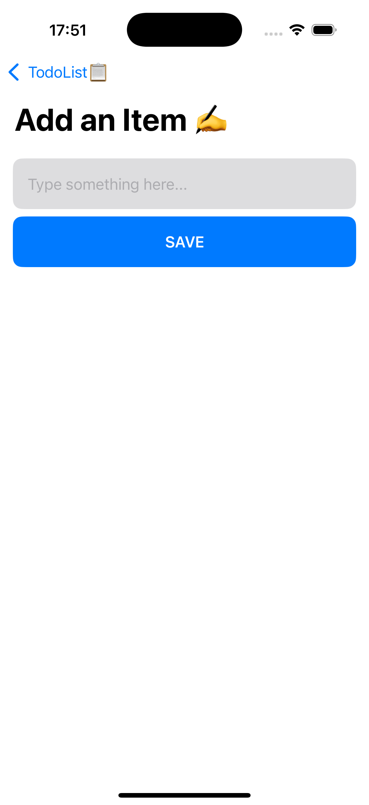
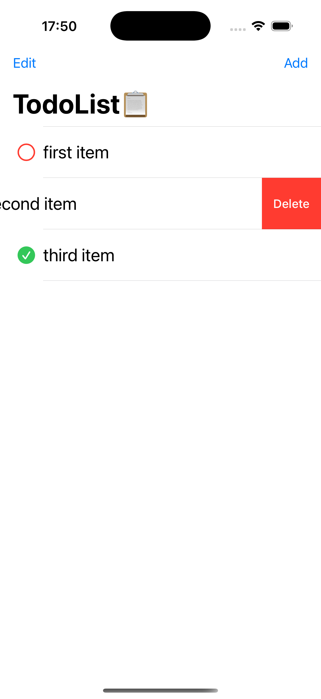
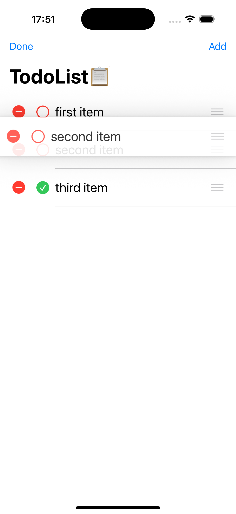
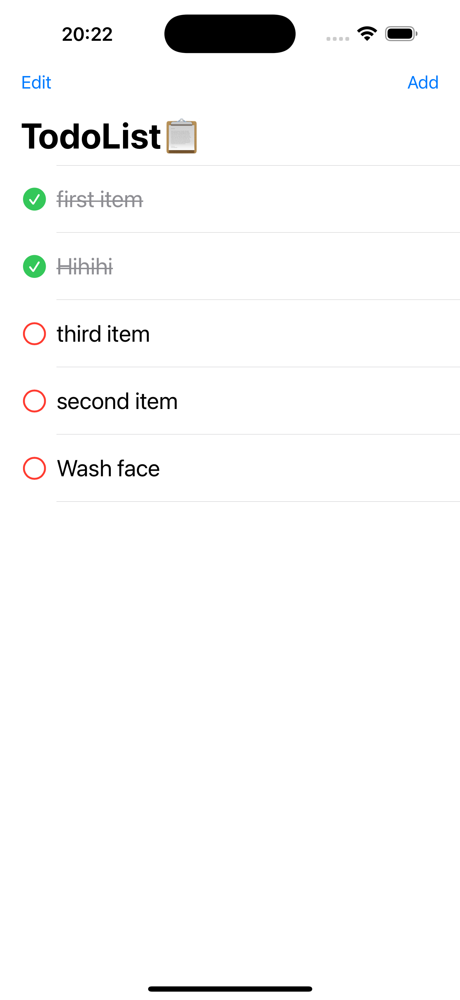

# 📝 TodoList – SwiftUI iOS App Practice

This is a minimalist Todo List iOS app built with **SwiftUI** and following the **MVVM architecture**. The project is part of my personal learning journey to practice native iOS development using Swift.

---

## ✅ Features (Implemented)

- ➕ **Add new todo items** via input view
- ✅ **Toggle item completion** (tap checkbox to mark done/undone)
- 📅 Set and display deadline for each todo item
- 🗑 **Swipe to delete** a todo item (right to left gesture)
- ☑️ **Reorder items** via drag and drop (after tapping "Edit")
- 📋 Clean, simple UI for listing todo tasks
- 📐 Built using the **MVVM pattern** for better separation of concerns
- 🌗 Light/Dark mode toggle with one tap

---

## 📱 Screenshots

### Main Todo List View

### Swipe to Delete

### Edit Mode - Drag to Reorder

### Add Item View

### Toggle Completion

## 🧠 Future Ideas

- 📱 UI polish and subtle animations
- 🛎 Notifications for upcoming deadlines

---

## 🏗️ Architecture

The app uses the **MVVM** (Model-View-ViewModel) design pattern:

- **Model**: `ItemModel` defines the data structure.
- **ViewModel**: `ListViewModel` handles list operations like delete and move.
- **View**: SwiftUI views (`ListView`, `ListRowView`, `AddView`) render the user interface.

---

## 🔧 Technologies

- Swift 5 + SwiftUI
- Xcode 15+
- State management with `@State`, `@ObservedObject`, `@EnvironmentObject`
- NavigationView, List, EditButton, etc.

---

## 📚 Learning Goals

Through this project, I’m practicing:

- SwiftUI layout and view composition
- Gesture-based interactions (swipe to delete, drag to move)
- MVVM structure in SwiftUI
- Data flow with `@Published` and `@StateObject`

---

## 💬 Feedback Welcome

This project is for learning purposes. Suggestions, ideas, or feedback are always welcome!
